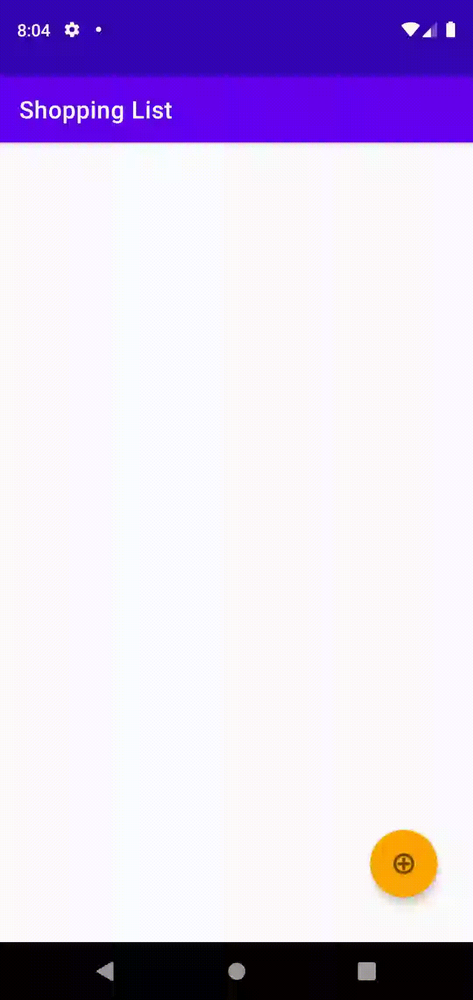

# Week 5 - Coding Challenge

This week's coding challenge was to build a small shopping list using Intent.
The first activity consists of all the items in the user's list. The Second Activity consists of all the possible items that can be added to the list.
Clicking on any of the item from the second activity adds the item to the user's list in the main activity.

## Shopping List

