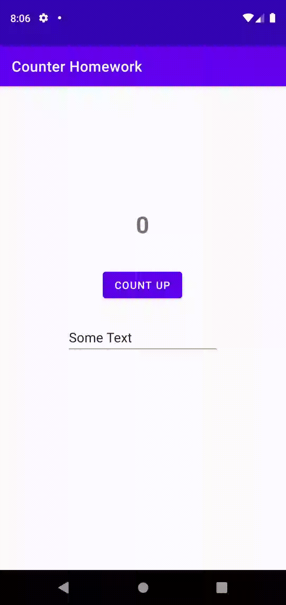

# Week 5 - Task

The task for this week expands upont the "TwoActivities" task from last week.
This task requires additions to the previous task to ensure that all the state are saved when the orientation of the device is changes.

## Saved State

